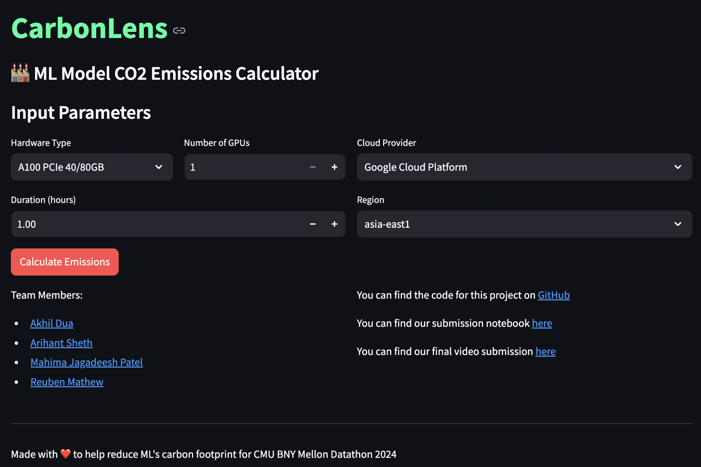

# CMU BNY Datathon 2024

This Streamlit application was created as a part of the CMU BNY Datathon 2024. 

# Screenshot of the Application


# Task
We have created **CarbonLens**, a tool that helps ML teams and companies assess the environmental impacts of training AI Models. The tool provides a dashboard that allows users to input the details of their model and get an estimate of the carbon emissions associated with training the model.

# Running the Application
To run the application, you can follow the steps below:
```bash
pip install -r requirements.txt
```

After installing the required packages, you can run the application using the following command:
```
streamlit run app.py
```

And your app should be running 😊

# Team Members
- [Akhil Dua](https://www.linkedin.com/in/akhil--dua/)
- [Arihant Sheth](https://www.linkedin.com/in/arihantsheth/)
- [Mahima Jagadeesh Patel](https://www.linkedin.com/in/mahima-jagadeesh-patel-8641441a3/)
- [Reuben Mathew](https://www.linkedin.com/in/iamreubengm/)

# Submission            
You can find our submission notebook [here](https://colab.research.google.com/drive/1NoLJQ5fjS00PnTC9FNXzQB_4NukTVwS0?usp=sharing)
            
You can find our final video submission [here](https://drive.google.com/file/d/1kJrBznn2JJ77qxepGrLWU6I-xTOgI61o/view?usp=sharing)

# References
Lacoste, Alexandre, et al. "Quantifying the carbon emissions of machine learning." arXiv preprint arXiv:1910.09700 (2019).